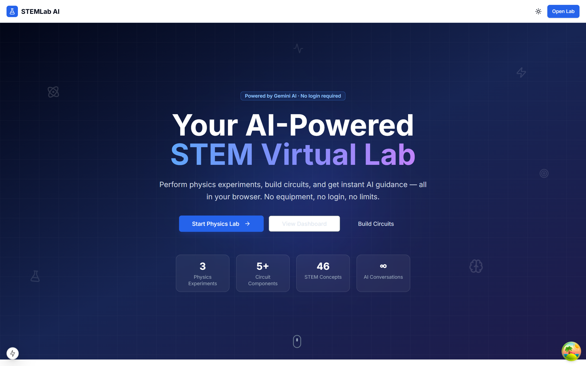
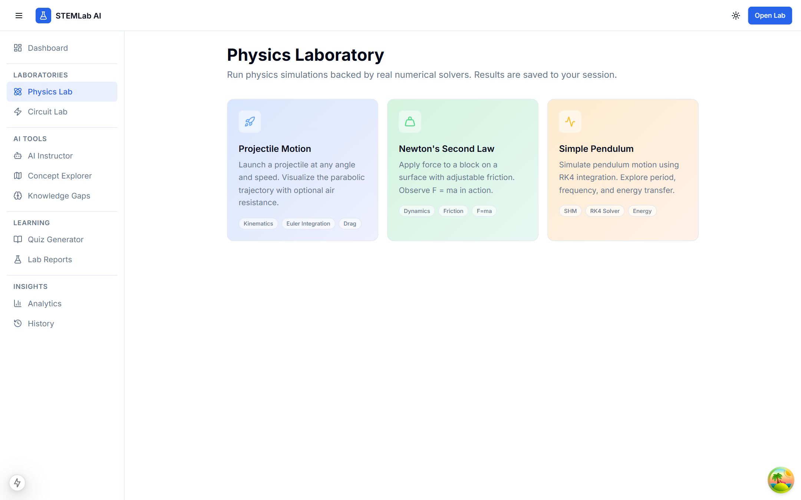
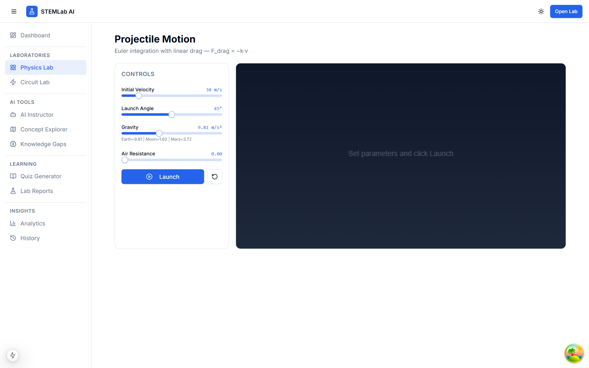
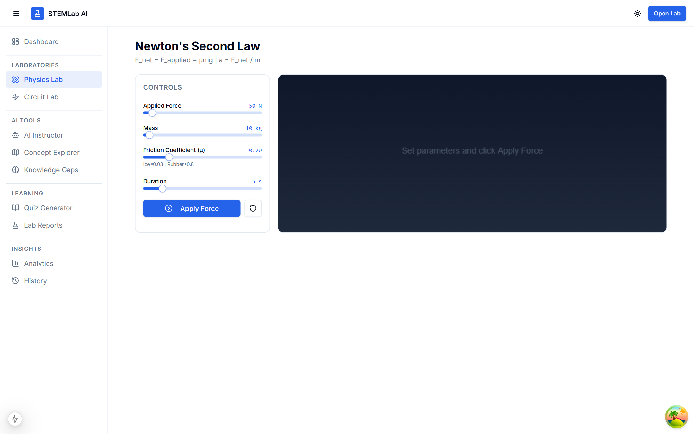
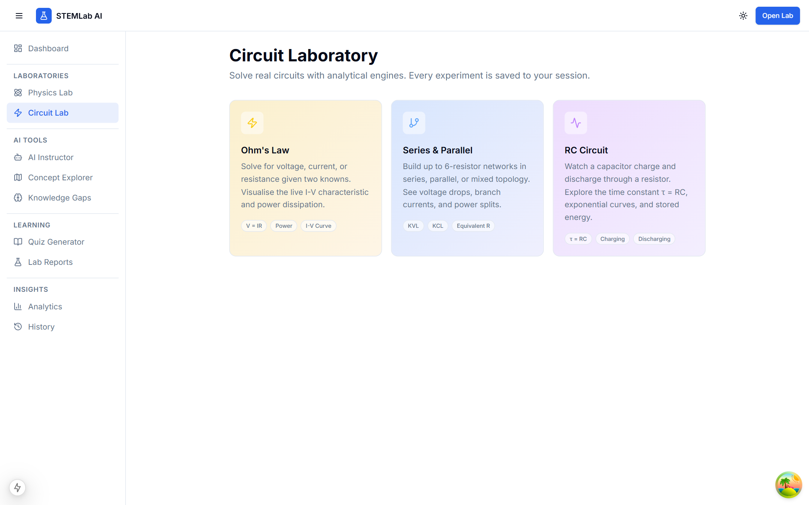
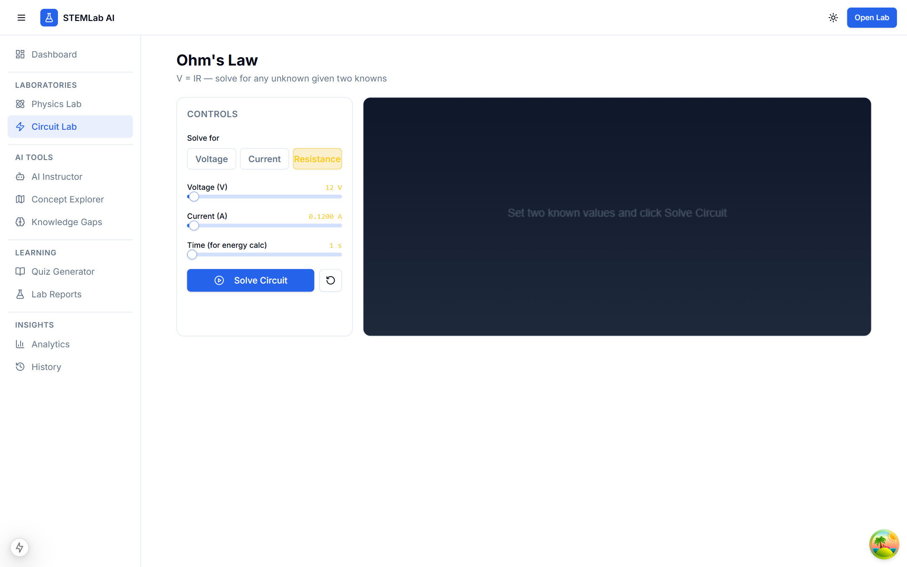
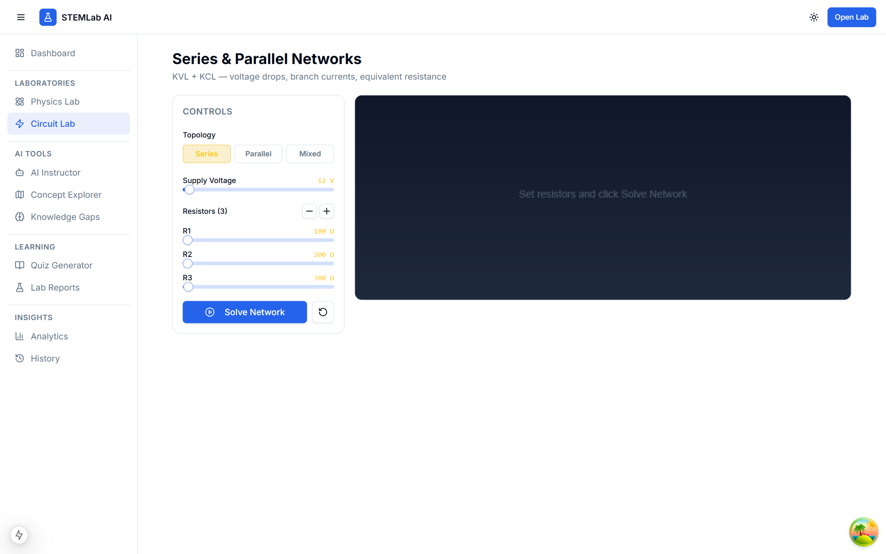
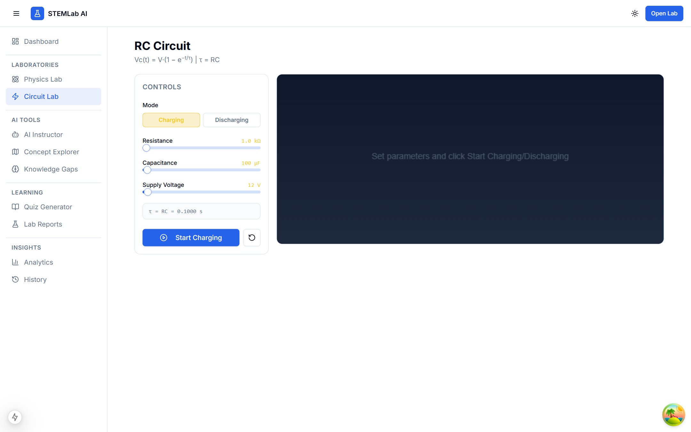
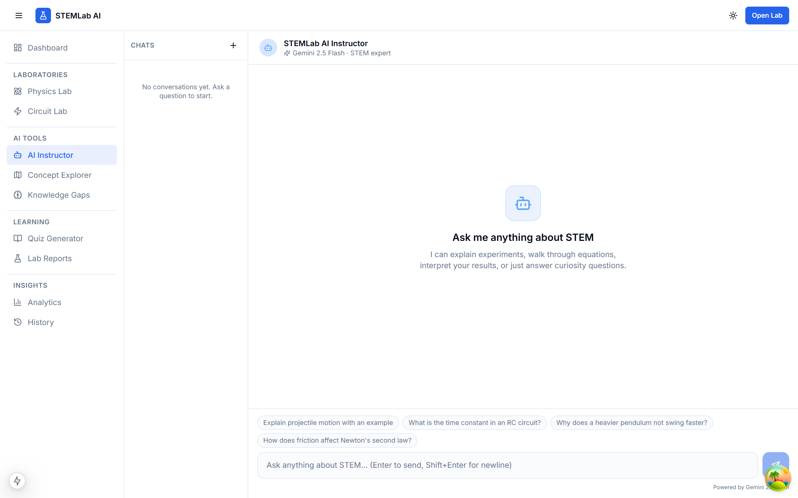

# STEMLab AI

**An AI-powered STEM Virtual Laboratory** — perform physics experiments, build circuits, and learn with real-time Gemini AI guidance. No login, no equipment, no limits.

[](https://nextjs.org)
[](https://fastapi.tiangolo.com)
[](https://ai.google.dev)
[](https://postgresql.org)
[](https://docker.com)

---

## Screenshots

### Dashboard


### Physics Laboratory


### Projectile Motion Simulator


### Newton's Second Law


### Simple Pendulum (RK4)


### Circuit Laboratory


### Ohm's Law Solver


### Series & Parallel Networks


### RC Circuit Analyzer


### AI Instructor (Gemini 2.5 Flash)


---

## Features

### Physics Laboratory
| Experiment | Engine | Highlights |
|---|---|---|
| Projectile Motion | Euler integration with drag | Adjustable velocity, angle, gravity, air resistance |
| Newton's Second Law | F = ma with friction | Real-time force arrows, velocity/acceleration graphs |
| Simple Pendulum | RK4 ODE solver | Large-angle support, period correction, energy graphs |

### Circuit Laboratory
| Experiment | Engine | Highlights |
|---|---|---|
| Ohm's Law | V = IR solver | Solve for V, I, or R; live I-V characteristic curve |
| Series & Parallel | KVL/KCL network solver | Up to 6 resistors, voltage drop + power charts |
| RC Circuit | Analytical: Vc(t) = Vs·(1−e^−t/τ) | Charge/discharge modes, τ reference line |

### AI Instructor
- Real-time streaming responses via **Gemini 2.5 Flash**
- Explains experiments, walks through equations, interprets results
- Conversation history saved per session (no login required)
- Experiment context awareness — references your actual lab results

---

## Quick Start (Docker)

```bash
# 1. Copy environment file and add your Gemini API key
cp .env.example .env
# Edit .env — set GEMINI_API_KEY

# 2. Build and start all services
docker compose up --build

# 3. Open in browser
open http://localhost:3000
```

| Service | Port | Description |
|---|---|---|
| Frontend | 3000 | Next.js 15 (dev server with HMR) |
| Backend | 8000 | FastAPI + uvicorn (--reload) |
| PostgreSQL | 5432 | Primary database |
| Nginx | 80 | Reverse proxy |

API docs available at `http://localhost:8000/docs`

---

## Tech Stack

**Frontend**
- Next.js 15 + TypeScript + TailwindCSS
- Shadcn UI + Framer Motion
- Zustand (UI state) + React Query (server state)
- HTML5 Canvas (experiment visualizations) + Recharts (graphs)
- ReactMarkdown (AI response rendering)

**Backend**
- FastAPI + Python 3.12
- SQLAlchemy 2.0 async + asyncpg + PostgreSQL
- Pydantic v2 + Alembic migrations
- google-genai SDK (Gemini streaming via SSE)

**Infrastructure**
- Docker Compose (postgres → backend → frontend → nginx)
- Anonymous session tracking via `X-Session-ID` header + cookie

---

## Project Structure

```
├── backend/
│   ├── app/
│   │   ├── api/v1/endpoints/   # physics, circuit, ai_instructor
│   │   ├── engines/            # physics & circuit simulation engines
│   │   │   ├── physics/        # projectile, newton, pendulum
│   │   │   ├── circuit/        # ohms, series_parallel, rc
│   │   │   └── ai/             # gemini_client (streaming)
│   │   ├── models/             # SQLAlchemy ORM models
│   │   ├── schemas/            # Pydantic request/response schemas
│   │   └── middleware/         # session, logging, error handling
│   └── pyproject.toml
├── frontend/
│   ├── src/
│   │   ├── app/                # Next.js App Router pages
│   │   ├── components/         # physics/, circuit/, ai-instructor/
│   │   ├── hooks/              # usePhysics, useCircuit
│   │   ├── stores/             # aiStore (Zustand)
│   │   └── lib/api/            # axios client + SSE streamChat
│   └── package.json
├── docker/nginx/default.conf
└── docker-compose.yml
```

---

## Development (without Docker)

### Backend
```bash
cd backend
pip install -e ".[dev]"
cp .env.example .env  # add GEMINI_API_KEY

# Requires a running PostgreSQL instance
alembic upgrade head
uvicorn app.main:app --host 0.0.0.0 --port 8000 --reload
```

### Frontend
```bash
cd frontend
npm install
# Create .env.local with: NEXT_PUBLIC_API_URL=http://localhost:8000

npm run dev
# Open http://localhost:3000
```

---

## Environment Variables

| Variable | Required | Description |
|---|---|---|
| `GEMINI_API_KEY` | **Yes** | Google Gemini API key — get one at [aistudio.google.com](https://aistudio.google.com/app/apikey) |
| `POSTGRES_PASSWORD` | No | DB password (default: `stemlab_dev_password`) |
| `SUPABASE_URL` | No | Supabase project URL (for PDF report storage) |
| `SUPABASE_KEY` | No | Supabase anon key |

---

## Roadmap

- [x] Phase 1 — Architecture & Core Backend
- [x] Phase 2 — Homepage & Dashboard
- [x] Phase 3 — Physics Laboratory (Projectile, Newton, Pendulum)
- [x] Phase 4 — Circuit Laboratory (Ohm's Law, Series/Parallel, RC)
- [x] Phase 5 — AI Instructor (Gemini 2.5 Flash streaming)
- [ ] Phase 6 — Quiz System + Concept Explorer
- [ ] Phase 7 — Reports + Analytics + Knowledge Gaps
- [ ] Phase 8 — History, Polish, Testing

---

## License

MIT
